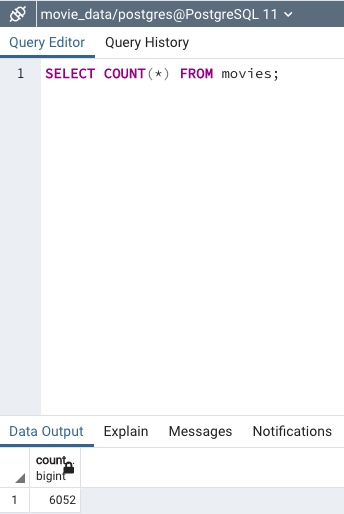
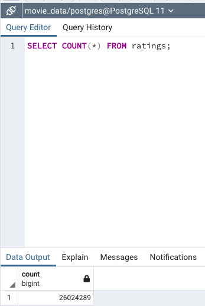

# Movies-ETL
## Overview
### Create one function that takes in the three files—Wikipedia data, Kaggle metadata, and the MovieLens rating data—and performs the ETL process by adding the data to a PostgreSQL database. Then, create an automated pipeline that takes in new data, performs the appropriate transformations and loads the data into existing tables.

### Write an ETL Function to Read Three Data Files
- The `wiki_movies_df` DataFrame

- The `kaggle_metadata` DataFrame

- The `ratings` DataFrame

### Extract and Transform the Wikipedia Data
- Cleaned wikipedia movies data as a DataFrame

- Add the columns from `wiki_movies_df` DataFrame to a list.

### Extract and Transform the Kaggle Data
- The `movies_with_ratings_df` DataFrame

- The `movies_df` DataFrame

### Create the Movie Database
- The `movies_query` counted rows

- The `ratings_query` counted rows

